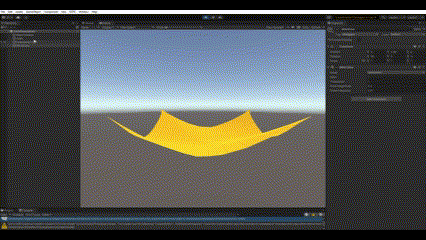

# Position-Based Dynamics
## 1. Introduction
Position-Based Dynamics was first proposed by Müller et al.【1】 as it provides multiple benefits over traditional methods. Specifically, it is more stable, computationally efficient, less laggy, and would not overshoot or drift.  
In this project, we created two scenes based on Position-Based Dynamics in Unity. In the first scene, we created a plane to simulate a horizontal cloth with fixed four corners. We applied wind force and gravity to it to observe the deformation of the original plane. In the second scene, we created multiple particles to simulate changes in fluid particles. Both scenes involve creating a Unity playground, defining the physical properties of the cloth, as well as various tuning to define the constraints that govern its behavior.
## 2. Repo Structure
- Assets/Scripts:
    - ClothSimulation: Scripts for cloth simulation scene.
      - Constraints.cs: Contains structures for constraints and the mesh.
      - PBDModel.cs: The behavior model for the cloth in which vertices' positions are initialized and updated.
- demos: contains demo videos and gif files for two scenes.
## 3. Cloth Simulation Scene
The cloth is positioned horizontally at the initial position. After pressing the play button, the plane will deform like cloth under the force of gravity and wind.
In this demo, 2 parameters can be changed.   
- Wind Force: By changing the Main property of the WindZone object, we can adjust the wind force in the environment. The demo shows the situation when wind force was changed from 1 to 5, then to 0.

- Shrink Coefficient: By changing the shrinkCoefficient property of the cloth object, the tightness of clothes can be adjusted. The smaller the shrinkCoefficient is, the looser the cloth is. The demo shows the situation that the shrink coefficient change from 10 to 5.  

## 4. Fluid Simulation Scene
## 5. Work Breakdown
Jingshan Feng: Create the cloth simulation scene. Implement position-based dynamic algorithm to a plane, recalculate triangles, vertices’ positions and normals of mesh to make the plane deform like cloth. 
# Reference
Matthias Müller, Nuttapong Chentanez, and Miles Macklin (2014). Position Based Dynamics. In Proceedings of the ACM SIGGRAPH/Eurographics Symposium on Computer Animation (SCA '14), 7-14. https://matthias-research.github.io/pages/publications/posBasedDyn.pdf
