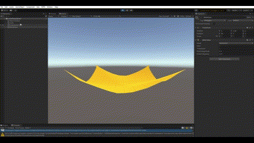

# Position-Based Dynamics

Group members: Jingshan Feng (jfa99), Yuke Wang (ywa390)

## Unity Setup

To begin, open the current project folder unity-position-based-dynamics as a Unity project in Unity Hub and select 2021.3.16f1 as the editor version.

## Introduction

Position-Based Dynamics was first proposed by Müller et al. $^1$ as it provides multiple benefits over traditional methods. Specifically, it is more stable, computationally efficient, less laggy, and would not overshoot or drift. 

In this project, we created two scenes with this idea in Unity. 
- In the first scene, we created a plane to simulate a horizontal cloth with fixed four corners. We applied wind force and gravity to it to observe the deformation of the original plane.
- In the second scene, we created multiple particles to simulate a fluid body, parimarily following Macklin et al.'s later reserach $^2$ for the simulation algorithm. We also partially used Akinci etl.'s SPH research $^3$ for boundary handling and the smoothing kernels (the Poly 6 and the Spiky kernels) from Müller et al. $^4$.

Both scenes involve creating a Unity playground, defining the physical objects, as well as various fine-tuning to identify the best constraint parameters to govern their behaviors.

## Repository Structure - Key Directories and Files
- `Assets/Scripts/`: Holds scripts for both scenes in their own sub-directories.
    - `ClothSimulation/`: Scripts for the cloth simulation scene.
      - `Constraints.cs`: Contains structures for constraints and the mesh.
      - `PBDModel.cs`: The behavior model for the cloth in which vertices' positions are initialized and updated.
    - `FluidSimulation/`: Scripts for the fluid simulation scene.
        - `HelperModules.cs`: TODO
        - `PBFDemo.cs`: TODO
- `Demos/`: Contains demo videos and gif files for two scenes in their respective sub-directories.
    - `ClothSimulationDemo/ClothSimulationDemo.mp4`

## Cloth Simulation Scene

The cloth is positioned horizontally at the initial position. After pressing the play button, the plane will deform like cloth under the force of gravity and wind.

In this demo, 2 parameters can be changed.   
- **Wind Force**: By changing the Main property of the WindZone object, we can adjust the wind force in the environment. The demo shows the situation when wind force was changed from 1 to 5, then to 0. The adjustable range of wind power is 0~5.

    

- **Shrink Coefficient**: By changing the shrinkCoefficient property of the cloth object, the tightness of clothes can be adjusted. The smaller the shrinkCoefficient is, the looser the cloth is. The demo shows the situation that the shrink coefficient change from 10 to 5. The adjustable range of wind power is 1~10.

    

## 4. Fluid Simulation Scene

TODO

## 5. Work Breakdown

Jingshan Feng: Create the cloth simulation scene. Implement position-based dynamic algorithm to a plane, recalculate triangles, vertices’ positions and normals of mesh to make the plane deform like cloth. 

Yuke Wang: TODO

# Reference

1. Müller, M., Heidelberger, B., Hennix, M., & Ratcliff, J. (2007). Position based dynamics. *Journal of Visual Communication and Image Representation*, 18(2), 109-118.

    **[Link to the above paper in PDF](https://matthias-research.github.io/pages/publications/posBasedDyn.pdf)**

2. Macklin, M., & Müller, M. (2013). Position based fluids. *ACM Transactions on Graphics (TOG)*, 32(4), 1-12.

    **[Link to the above paper in PDF](https://dl.acm.org/doi/pdf/10.1145/2461912.2461984)**

3. Akinci, N., Ihmsen, M., Akinci, G., Solenthaler, B., & Teschner, M. (2012). Versatile rigid-fluid coupling for incompressible SPH. *ACM Transactions on Graphics (TOG)*, 31(4), 1-8.

    **[Link to the above paper in PDF](https://dl.acm.org/doi/pdf/10.1145/2185520.2185558)**

4. Müller, M., Charypar, D., & Gross, M. (2003, July). Particle-based fluid simulation for interactive applications. In *Proceedings of the 2003 ACM SIGGRAPH/Eurographics symposium on Computer animation* (pp. 154-159).

    **[Link to the above paper in PDF](https://citeseerx.ist.psu.edu/document?repid=rep1&type=pdf&doi=1739fd145ef1d327ab301cacc017af2a87f33086)**